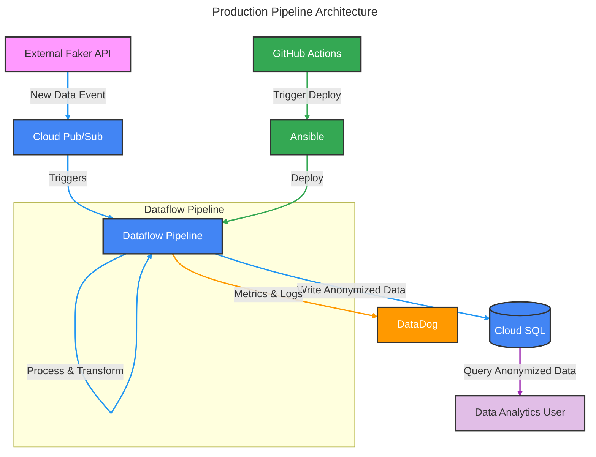

# Production Pipeline Overview

## 1. Architecture Changes

### Data Ingestion
- Replace direct data-fetching API calls with a message queue (ex., RabbitMQ)
- Use event based technique to fetch new data, instead of polling (ex. PubSub)

### Data Storage
- Replace SQLite with a production-grade DB (ex., PostgreSQL, CloudSQL, BigQuery)
- Support DB migrations and rollbacks for schema changes (ex. Alembic)
- Implement DB indexing and/or partitioning for better performance
- Set up DB replication for high availability

### Processing ETL Pipeline
- Move to an asynchronous processing model (ex. Apache Beam, GCP Dataflow)
- Parallelism affords better throughput
- Checkpointing for resumable operations
- Graph representation allows better identification of bottlenecks, resource usage

## 2. Reliability & Monitoring

### Logging & Monitoring
- Implement structured logging (ex., JSON format)
- Set up metrics collection, monitoring dashboards (ex. Datadog, Grafana)
- Add alerting for critical failures

### Error Handling
- Implement better error classification - helps with debugging
- Create error recovery procedures

### Data Quality
- Improve data/schema validation at ingestion (ex. Cerberus)
- Implement more robust data quality checks - partial data allowed?
- Monitor/handle for data duplication
- Create data quality dashboards, metrics, and/or alerts

## 3. Scalability & Performance

### Infrastructure
- Implement horizontal scaling (K8s, or comes for free with Dataflow)
- Add load balancing, auto-scaling based on metrics
- Identify cost/performance trade-offs with scaling vertically

### Performance
- Implement database query optimization
- Add database indexing based on frequent queries

## 4. Security & Compliance

### Data Security
- Set up role-based access control (IAM) for DB, API access
- Add data masking for sensitive information (or omit entirely like we do now)

### Compliance
- Add data retention policies
- Set up GDPR compliant data anonymization rules

## 5. Deployment & Operations

### CI/CD Pipeline
- Automated testing (unit, integration, e2e) (ex. CircleCI/Github Actions)
- Code quality checks (ex. flake8, black)
- Security scanning  (ex. SonarCube)
- Automated deployments (ex. Ansible)

### Infrastructure as Code
- Terraform for infrastructure
- Kubernetes manifest + Helm charts for environment templating if using K8s
- Secret management

### Operational Procedures
- Design deployment procedures with an Ops Team
- Rollbacks, incident response
- Staging and production releases
- Post-deployment health/sanity checks
- Backup and recovery
- Maintenance windows

## 6. Data Flow Diagram

> **Note**: This diagram is rendered automatically on GitHub. If you're viewing this elsewhere, here are alternative viewing options:
> 1. View on GitHub directly
> 2. Use the [Mermaid Live Editor](https://mermaid.live)
> 3. Install a Mermaid viewer extension for your browser or IDE

### Diagram Components:

1. **Data Flow**:
   - External Faker API generates new data events
   - Cloud Pub/Sub receives events and triggers pipeline - the event-driven architecture enables loose coupling and real-time processing of data as it arrives.
   - Dataflow pipeline processes and transforms data - Dataflow/Apache Beam was chosen as it provides serverless, auto-scaling data processing that can handle variable load and complex transformations.
   - Anonymized data is written to Cloud SQL. CloudSQL was chosen over BigQuery for its ACID compliance (database concistency & reliability), lower latency for real-time transactions, and cost-effectiveness for this smaller workload size
   - Metrics and logs are sent to DataDog - these can be used for monitoring, debugging, and targeted optimizations.
   - Data Analytics Users can query the anonymized data directly from CloudSQL. IAM permissions would be set up at this level to define granular access to results.

2. **Deployment Flow**:
   - GitHub Actions triggers deployments (ex. release or merge to main)
   - Ansible handles deployment to GCP
   - Pipeline updates are deployed to Dataflow

3. **Key Features**:
   - Event-driven architecture
   - Scalable processing with Dataflow
   - User facing SQL database
   - Real-time monitoring with Datadog
   - Automated deployment with CI + Ansible
   - Data access for analytics via CloudSQL
